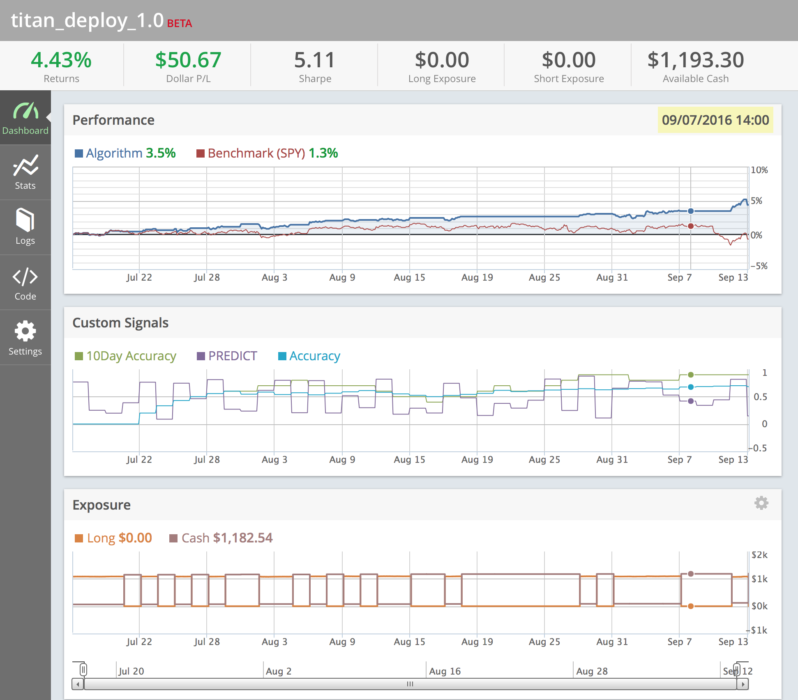

# quantraider

Automated stock market trading demos and tools, by Nicholas Bradford. All are deprecated as of September 2016. Here's an example of an SVM-based algorithm running with Quantopian/Robinhood (see QuantopianArchive for template):

<b>Algotrader</b>: Demo of machine-learning based stock trading strategies.

<b>QuantopianArchive</b>: Algorithms and templates for use with [Quantopian](https://www.quantopian.com/).

<b>Webscraper</b>: Tool for tracking multiple live algorithms.
